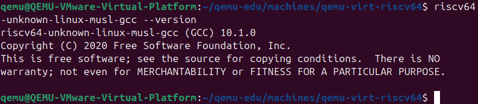
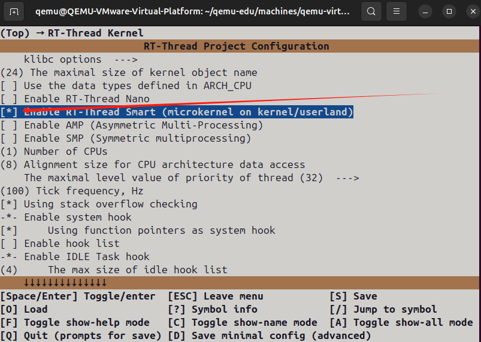
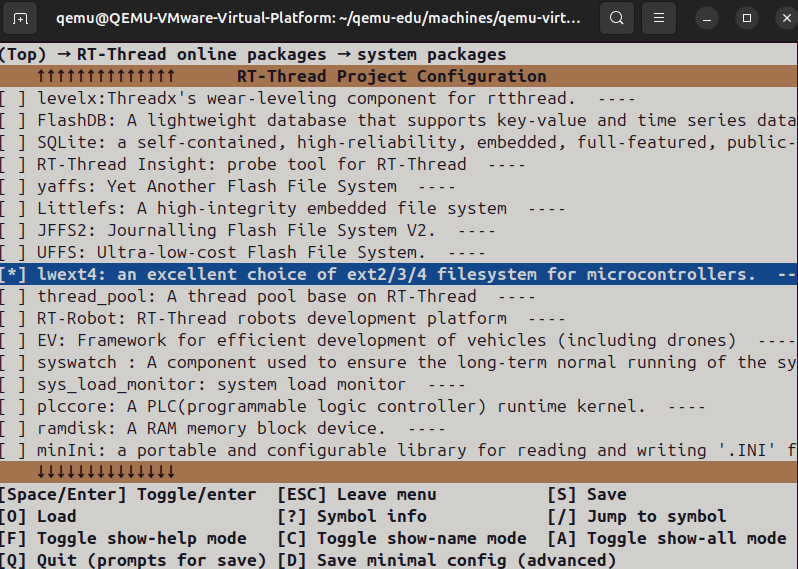
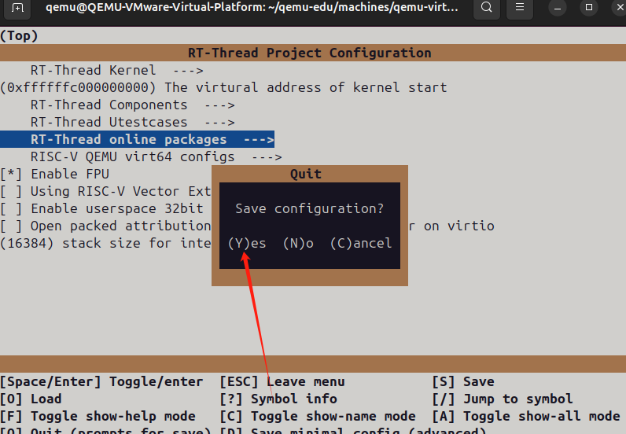
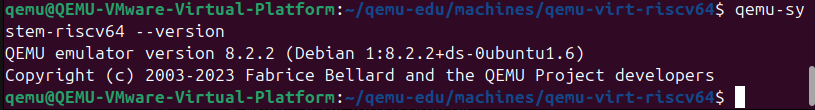
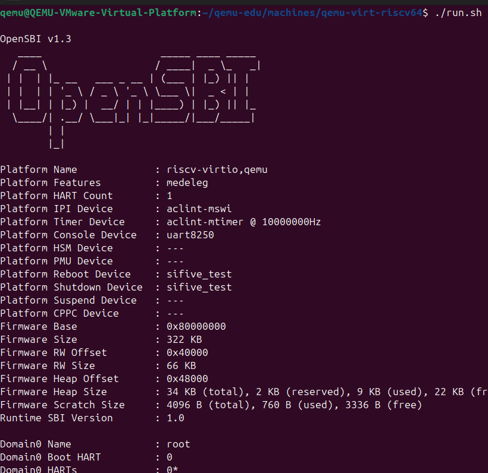
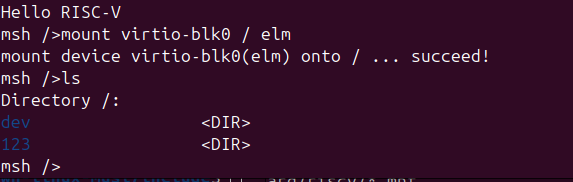
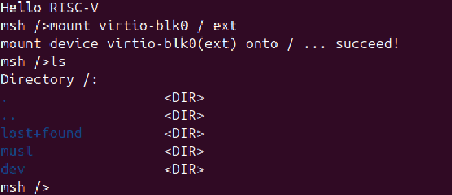
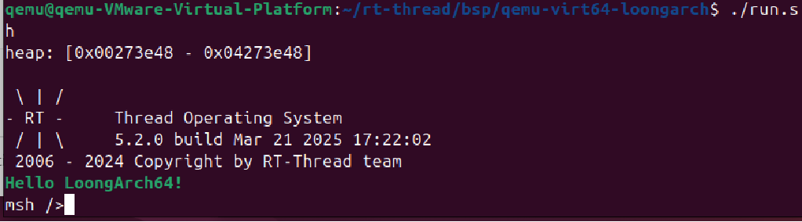

# QEMU/RISCV64 环境配置搭建快速上手

## 安装环境

VMware Workstation Pro

Ubuntu版本：24.06

QEMU版本：8.2.2（最低需要6.2.0)

网络部分：建议在搭建前提前配置好代理,主要是git和wget

建议执行以下ubuntu的软件安装，确保已经有git等工具

```
sudo apt-get update
sudo apt-get install git build-essential cmake
```

## 配置RT-Thread ENV环境

### ENV工具简介
RT-Thread推出的开发辅助工具env，是针对基于RT-Thread操作系统的项目工程提供编译构建环境、图形化系统配置以及软件包管理三大核心功能。

其内置的menuconfig提供了简单易用的配置剪裁工具

用户可以轻松对内核、组件和软件包进行自由裁剪，从而以搭积木的方式灵活构建系统。

这一机制与Linux中的menuconfig源码配置方式类似，极大地简化了系统的定制化过程，提升了开发效率。

### 下载安装

```
wget https://raw.githubusercontent.com/RT-Thread/env/master/install_ubuntu.sh
chmod 777 install_ubuntu.sh
./install_ubuntu.sh
sudo apt install scons python3-kconfiglib python3-tqdm
```

安装完成后需要激活当前终端的环境变量，

> 注意：激活的环境变量只对当前终端有效

```
source ~/.env/env.sh
```

> 如果需要在开启终端的时候自动激活，可以将这条命令放到~/.bashrc里，这样开启新终端的时候就会自动输入这条命令
>
> ENV仓库地址:[RT-Thread/env: Python Scripts for RT-Thread/ENV](https://github.com/RT-Thread/env)

## 第一步：拉取仓库并配置工具链

### 介绍仓库

qemu-edu仓库主要用于板卡的适配工作，通过将RT-Thread内核以子模块的形式集成到项目中，实现了对不同板卡的支持与功能扩展。

### 拉取仓库

```
cd ~
git clone https://github.com/oscomp/RT-Thread
cd qemu-edu
git submodule update --init --force --recursive
```

git clone用于拉取仓库

git submodule用于拉取RT-Thread内核仓库

### 配置工具链

下载对应的Smart工具链压缩包(此处的工具链仅供演示)

来到拉取的仓库下的toolchains目录下，找到对应riscv的工具链，解压到/opt目录

```
cd toolchains/qemu-virt-riscv64
sudo tar zxvf riscv64-linux-musleabi_for_x86_64-pc-linux-gnu_latest.tar.bz2 -C /opt
```

配置临时环境变量

```
export RTT_EXEC_PATH=/opt/riscv64gc-linux-musleabi_for_x86_64-pc-linux-gnu/bin
export RTT_CC_PREFIX=riscv64-unknown-linux-musl-
export PATH=/opt/riscv64gc-linux-musleabi_for_x86_64-pc-linux-gnu/bin:$PATH
```

验证下是否配置成功

```
riscv64-unknown-linux-musl-gcc --version
```



### 配置menuconfig组件和软件包

#### RT-Thread Smart配置

为了让内核能够支持运行挂载镜像上的脚本，这里需要开启RT-Thread Smart功能

在终端输入scons --menuconfig打开图形化配置界面

```
source ~/.env/env.sh
scons --menuconfig
```

上下键控制移动，空格确认打开，回车进入子菜单（如果有的话），ESC键返回

找到RT-Thread Kernel选项进入可以看到对应的Enable RT-Thread Smart，按下空格看见有个星号即可



按下ESC返回，直到退出的最后一步会询问你是否保存，按下Y即可保存

#### 文件系统配置

为了能支持ext4镜像，还需要打开对应的软件包,跟上述配置一样的操作

如图第一排的是路径，按照该路径来到当前菜单

随后选择lwext4软件包即可打开该软件包



按下ESC返回，最后一步会询问你是否保存，按下Y即可保存



由于软件包是需要通过外部仓库的形式下载的，所以用到下面的命令下载对应仓库

```
pkgs --update
```

这样就算是配置好了,随后编译

```
scons -j12
```

编译完成后会在目录下生成一个rtthread.bin文件，这里就是等下要用到的内核文件

## 第二步：安装QEMU并运行QEMU-RISCV模拟器

打开终端输入下面的命令安装高版本的QEMU

```
sudo apt update
sudo apt install qemu-system-misc
```

安装完毕后可以看一下版本

```
qemu-system-riscv64 --version
```



### 运行QEMU-RISCV模拟器

来到qemu-virt-riscv64目录下，输入运行命令即可将rtthread跑起来

```
qemu-system-riscv64 -nographic -machine virt -m 256M -kernel rtthread.bin
```

在当前目录下有一个脚本"run.sh"，里面默认配置各种硬件设备，包括存储设备、网络设备和串行设备，从而实现虚拟机与外部环境的交互。

```
./run.sh
```

同样输入命令运行即可调用刚刚生成的bin文件启动qemu



### 挂载fat格式镜像

当第一次使用run.sh启动qemu时，会在当前目录下自动生成空的sd.bin的fat格式镜像文件

可以尝试对其进行挂载

```
mount virtio-blk0 / elm
```



- 如何退出 qemu，CTRL + a 组合键按下后，松开，再按一下 x 键

# 第三步：尝试编译评测案例并挂载ext4镜像

对[赛题评测样例]([oscomp/testsuits-for-oskernel at pre-2025](https://github.com/oscomp/testsuits-for-oskernel/tree/pre-2025))进行编译测试

首先拉取仓库到本地

```
git clone -b pre-2025 https://github.com/oscomp/testsuits-for-oskernel.git
```

## 修改工具链

通过修改Makefile来调用 RT-Thread Smart的工具链

分别修改以下文件:

### Makefile:

```
DOCKER ?= docker.educg.net/cg/os-contest:20250226

all: sdcard

build-all: build-rv

build-rv:
	make -f Makefile.sub clean
	mkdir -p sdcard/riscv/musl
	make -f Makefile.sub PREFIX=riscv64-unknown-linux-musl- DESTDIR=sdcard/riscv/musl
	cp /opt/riscv64gc-linux-musleabi_for_x86_64-pc-linux-gnu/riscv64-unknown-linux-musl/lib/libc.so sdcard/riscv/musl/lib
	sed -E -i 's/#### OS COMP TEST GROUP ([^ ]+) ([^ ]+) ####/#### OS COMP TEST GROUP \1 \2-musl ####/g' sdcard/riscv/musl/*_testcode.sh

sdcard: build-all .PHONY
	dd if=/dev/zero of=sdcard-rv.img count=128 bs=1M
	mkfs.ext4 sdcard-rv.img
	mkdir -p mnt
	sudo mount sdcard-rv.img mnt
	sudo cp -rL sdcard/riscv/* mnt
	sudo umount mnt

clean:
	make -f Makefile.sub clean
	rm -rf sdcard/riscv/*
	rm -rf sdcard/loongarch/*

docker:
	docker run --rm -it -v .:/code --entrypoint bash -w /code --privileged $(DOCKER)


.PHONY:

```

### basic/user/CMakeLists.txt:

```
cmake_minimum_required(VERSION 3.13)

project(user)
enable_language(ASM)
set(CMAKE_OSX_DEPLOYMENT_TARGET "")

# Path
if (${ARCH} STREQUAL riscv32 OR ${ARCH} STREQUAL riscv64)
    set(ARCH_DIR lib/arch/riscv)
else()
    set(ARCH_DIR lib/arch/${ARCH})
endif()

set(ASM_DIR asm)
set(BIN_DIR bin)

# Toolchain
set(PREFIX ${ARCH}-unknown-linux-musl-)
# riscv64-unknown-elf-

if (${ARCH} STREQUAL riscv32)
    set(CMAKE_C_FLAGS       "-march=rv32imac -mabi=ilp32 -mcmodel=medany")
elseif (${ARCH} STREQUAL riscv64)
    set(CMAKE_C_FLAGS       "-march=rv64imac -mabi=lp64 -mcmodel=medany")
else()
    message("Unsupported arch: ${ARCH}")
endif ()

set(CMAKE_ASM_COMPILER      ${PREFIX}gcc)
set(CMAKE_C_COMPILER        ${PREFIX}gcc)
set(CMAKE_OBJCOPY           ${PREFIX}objcopy)
set(CMAKE_OBJDUMP           ${PREFIX}objdump)
set(CMAKE_RANLIB            ${PREFIX}ranlib)
set(CMAKE_C_FLAGS           "${CMAKE_C_FLAGS} -fno-builtin -nostdinc -fno-stack-protector -ggdb -Wall")
set(CMAKE_ASM_FLAGS         ${CMAKE_C_FLAGS})
set(CMAKE_C_LINK_FLAGS      "${LINK_FLAGS} -nostdlib -T ${CMAKE_CURRENT_SOURCE_DIR}/${ARCH_DIR}/user.ld")

# Library
aux_source_directory(lib LIBS)
#set(LIBS ${ARCH_DIR}/crt.S ${LIBS})
set(LIBS ${ARCH_DIR}/crt.S ${ARCH_DIR}/clone.s ${LIBS})
add_library(ulib ${LIBS} syscall_ids)
include_directories(include/)
target_include_directories(ulib PRIVATE ${ARCH_DIR})

# Execuatble
set(ENTRY "0x1000")
#aux_source_directory(src SRCS)
aux_source_directory(src/oscomp SRCS)
set(EXECUTABLE_OUTPUT_PATH ${ARCH})
foreach(PATH ${SRCS})
    get_filename_component(NAME ${PATH} NAME_WE)

    if ("${CHAPTER}" STREQUAL 2)
        math(EXPR ENTRY "0x80400000" OUTPUT_FORMAT HEXADECIMAL)
    endif ()

    if ("${CHAPTER}" MATCHES 3_*)
        if(${NAME} STREQUAL ch4_mmap0)
            break ()
        elseif (${NAME} STREQUAL ch2_exit OR ${NAME} STREQUAL ch3_1_yield0 OR ${NAME} STREQUAL ch3_2_stride0)
            math(EXPR ENTRY "0x80400000" OUTPUT_FORMAT HEXADECIMAL)
        elseif (${NAME} STREQUAL ch3t_deadloop)
            math(EXPR ENTRY "0x80500000" OUTPUT_FORMAT HEXADECIMAL)
        else ()
            math(EXPR ENTRY "${ENTRY} + 0x20000" OUTPUT_FORMAT HEXADECIMAL)
        endif ()
    endif ()

    add_executable(${NAME} ${PATH})
    target_link_libraries(${NAME} ulib)
    target_link_options(${NAME} PRIVATE -Ttext ${ENTRY})

    add_custom_command(
            TARGET ${NAME}
            POST_BUILD
            COMMAND mkdir -p ${ASM_DIR}
            COMMAND ${CMAKE_OBJDUMP} ARGS -d -S $<TARGET_FILE:${NAME}> > ${ASM_DIR}/${NAME}.asm
    )
    add_custom_command(
            TARGET ${NAME}
            POST_BUILD
            COMMAND mkdir -p ${BIN_DIR}
            COMMAND ${CMAKE_OBJCOPY} ARGS -O binary $<TARGET_FILE:${NAME}> ${BIN_DIR}/${NAME}.bin --set-section-flags .bss=alloc,load,contents
    )
endforeach()

add_custom_command(
        OUTPUT syscall_ids.h
        COMMAND cp ${CMAKE_SOURCE_DIR}/${ARCH_DIR}/syscall_ids.h.in ${CMAKE_SOURCE_DIR}/lib/syscall_ids.h
        COMMAND sed ARGS -n -e s/__NR_/SYS_/p
        < ${CMAKE_SOURCE_DIR}/${ARCH_DIR}/syscall_ids.h.in
        >> ${CMAKE_SOURCE_DIR}/lib/syscall_ids.h
)
```

由于我这新开了一个终端所以还需要配置下临时环境变量

```
export RTT_EXEC_PATH=/opt/riscv64gc-linux-musleabi_for_x86_64-pc-linux-gnu/bin
export RTT_CC_PREFIX=riscv64-unknown-linux-musl-
export PATH=/opt/riscv64gc-linux-musleabi_for_x86_64-pc-linux-gnu/bin:$PATH
```

这时输入make即可自动编译

最后生成的sdcard-rv.img移动到qemu-virt-riscv64目录下即可

运行模拟器并且挂载ext4镜像

```
./run sdcard-rv.img
```

跑起来后手动挂载一下

```
mount virtio-blk0 / ext
```




# 第五步：QEMU-LoongsonLab环境搭建与配置

## 下载仓库

```
git clone https://github.com/LoongsonLab/rt-thread.git
```

## 工具链安装

```
wget https://github.com/LoongsonLab/oscomp-toolchains-for-oskernel/releases/download/loongarch64-cross-toolchains/loongarch64-musl-gcc-nightly-2025-3-15.tar.gz
sudo tar zxf loongarch64-musl-gcc-nightly-2025-3-15.tar.gz -C /opt/
```

## 配置环境变量

```
export RTT_EXEC_PATH=/opt/riscv64gc-linux-musleabi_for_x86_64-pc-linux-gnu/bin
export RTT_CC_PREFIX=riscv64-unknown-linux-musl-
export PATH=/opt/riscv64gc-linux-musleabi_for_x86_64-pc-linux-gnu/bin:$PATH
```

## 环境搭建

```
cd bsp/qemu-virt64-loongarch
scons --menuconfig (无需设置，进入后在退出保存一下相当于初始化)
source ~/.env/env.sh
pkgs --update
scons -j16
```

## 运行

输入qemu的命令运行或者运行目录下的'run.sh' 但是注意要将run.sh里面的-m 256M改为-m 1024M

```
qemu-system-loongarch64 -nographic -machine virt -cpu la464 -m 1024M -kernel rtthread.elf
```


