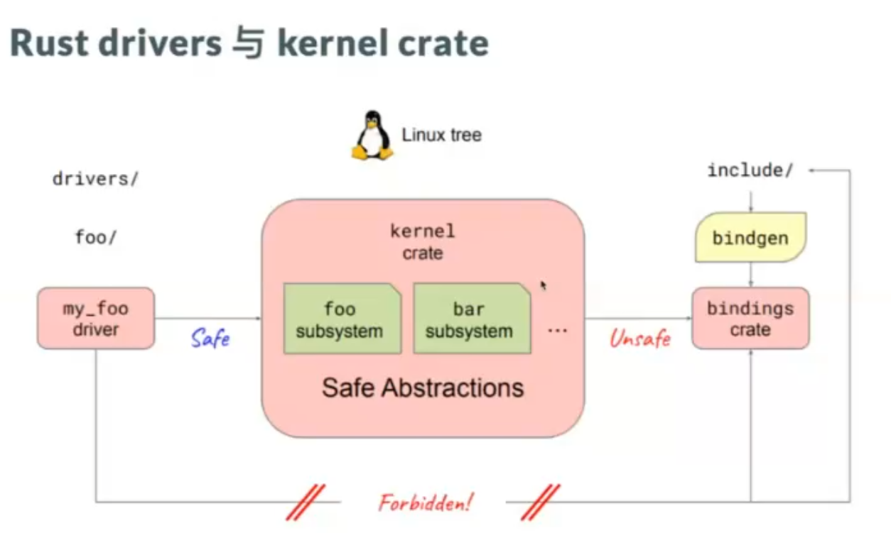
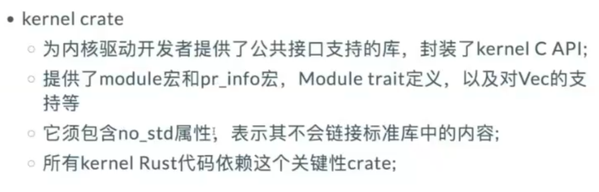
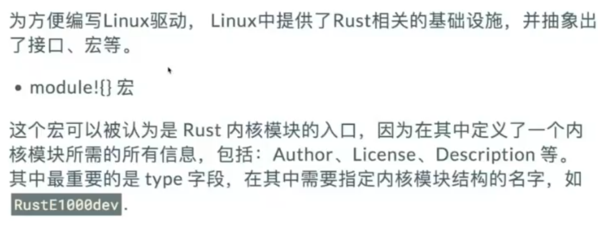
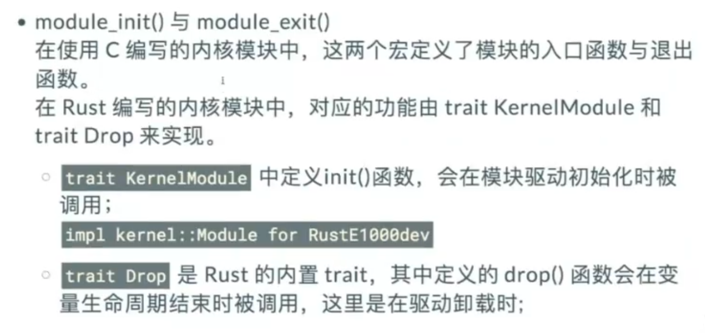

步骤一：初始化仓库
步骤二：添加 RT-Thread 作为子模块

```shell
git submodule add <rt-thread 仓库地址> rt-thread
```

步骤三：创建 Rust FFI 桥接层

```shell
cargo new rustffi --lib
```

在 rustffi 里实现 FFI 相关代码（如 fmt.rs），并编写 build.rs、SConscript 实现与 C 代码的混合编译。
Cargo.toml 配置依赖和 crate 类型。
步骤四：创建 Rust 应用层

```shell
cargo new rustapp --bin
```

编写主业务逻辑，依赖 rustffi，通过 FFI 调用 RT-Thread 功能。




